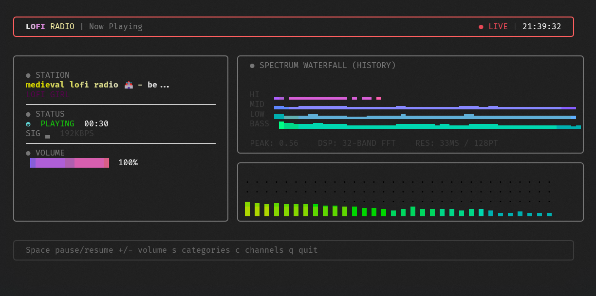

# 🎧 Lofi Radio

A sleek, lightweight command-line interface for streaming high-quality Lofi music. Built with Go, powered by `yt-dlp`, `ffmpeg`, `oto`, and `go-tui`.


<p align="center">
  
</p>

## ✨ Features

- **Interactive Full-Screen TUI**: Built on [`go-tui`](https://github.com/grindlemire/go-tui) with clean category picker and now-playing screen.
- **Auto-Discovery**: Fetches currently available categories from the selected channel playlist.
- **Lightweight**: Minimal CPU and memory footprint compared to browser-based playback.

## 📻 Supported Channels
Planned channel roadmap:
- [x] **Lofi Girl**
- [x] **Chillhop Music**
- [x] **the bootleg boy**
- [x] **STEEZYASFUCK**
- [x] **Claude FM**
- [ ] **The Jazz Hop Café**
- [x] **Homework Radio**
- [ ] **Ambition**
- [ ] **Dreamy**
- [ ] **Lofi Geek**
- [ ] **Chill with Taiki**
- [x] **Intimate Vibes**

## 🚀 Getting Started

### Prerequisites

- [Go](https://go.dev/doc/install) (1.25.1 or later)
- Internet connection

### Dependencies
- [yt-dlp](https://github.com/yt-dlp/yt-dlp): For extracting audio streams from YouTube.
- [FFmpeg](https://ffmpeg.org/): For audio decoding.
- [oto](https://github.com/hajimehoshi/oto): For low-level audio playback.
- [go-tui](https://github.com/grindlemire/go-tui): For the terminal UI framework.

## 📦 Installation

### One-line installer

- Windows (PowerShell):
  ```powershell
  irm https://raw.githubusercontent.com/KidiXDev/lofi-radio/main/scripts/install.ps1 | iex
  ```
- Linux:
  ```bash
  curl -fsSL https://raw.githubusercontent.com/KidiXDev/lofi-radio/main/scripts/install.sh | bash
  ```

### Download from Releases

1. Open the [Releases page](https://github.com/KidiXDev/lofi-radio/releases/latest).
2. Download the asset for your platform:
   - `lofi-radio_Windows_x86_64.zip` or `lofi-radio_Windows_arm64.zip`
   - `lofi-radio_Linux_x86_64.tar.gz` or `lofi-radio_Linux_arm64.tar.gz`
3. Extract the binary:
   - Windows: `lofi.exe`
   - Linux: `lofi`
4. Put it in a directory available in your `PATH`.


Installer behavior:
- Downloads the latest release for your OS/architecture.
- Installs into a user-safe directory:
  - Windows: `%LOCALAPPDATA%\lofi-radio\bin`
  - Linux: `~/.local/bin/lofi-radio`
- Adds the install directory to `PATH` for future shells.
- Then you can run: `lofi`

## 🔄 Updates

- Install latest update from GitHub Releases:
  ```bash
  lofi -update
  ```
- Optional custom install location during update:
  ```bash
  lofi -update -update-install-dir "/custom/path"
  ```

## 🗺️ Roadmap

We are continuously working to make **Lofi Radio** the best terminal-based lofi player. Here is what we have planned:

- [x] **TUI Category Picker**: Add a screen to switch between different lofi categories seamlessly.
- [x] **TUI Channels Picker**: Add a screen to switch between different lofi channels seamlessly.
- [x] **Volume Control**: Native volume adjustment within the TUI.
- [x] **Visualizers**: Add an ASCII-based audio visualizer for that extra retro feel.
- [x] **Auto Detect FFMPEG and yt-dlp** : Automatically detect FFMPEG and yt-dlp and install them if not found.
- [ ] **Favorites**: Bookmark specific tracks or streams.
- [ ] **Sleep Timer**: Automatically stop playback after a set duration.
- [ ] **Discord Rich Presence**: Add Discord Rich Presence to show current music category and channel.
- [ ] **Detach Mode**: Run in background support
- [ ] **Custom Playlist**: Add support for custom playlists.
- [ ] **Auto Update**: Add support for auto updates.
- [x] **Linux Support**: Add support for Linux.
- [x] **Windows Support**: Add support for Windows.
- [x] **Permissions Check**: Check write permissions in the executable directory.
- [x] **Cache**: Add cache for categories for faster loading.
- [x] **Self Uninstall**: Add support for self uninstall.
- [ ] **MacOS Support**: Add support for MacOS.

and more to come !

## 📜 License

Distributed under the [GNU General Public License v3.0](LICENSE).